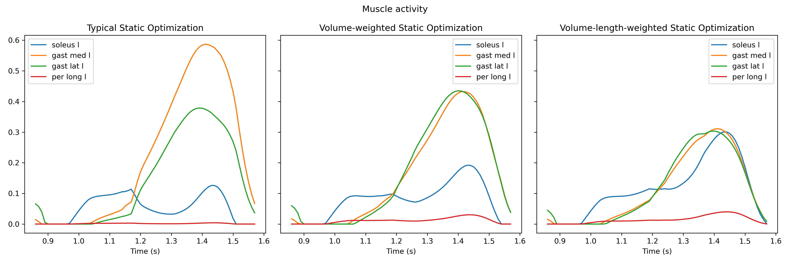
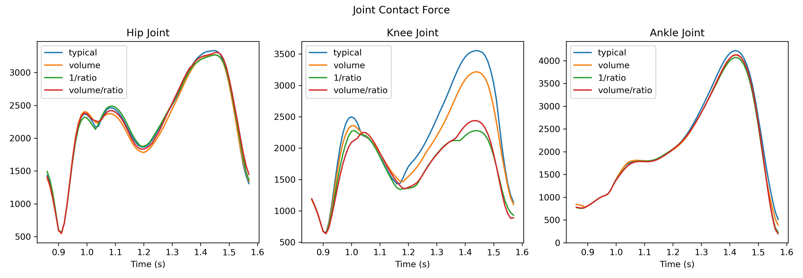

# cunstom Static Optimization 
WIP

The input files are data associated with Rajagopal model's walking simulation.

Typical Static Optimization, i.e., minimize the sum of squared muscle activation, with and without weighted cost function:

Muscles activity

Joint contact force

# Math
$$ PCSA = {MIF \over 60} $$

$$ V = OFL * PCSA $$

$$ R = {{OFL * \cos \alpha} \over {OFL * \cos \alpha + TSL}} $$

$$ F_0 = min\sum_{i=1}^{N nuscles} a_i^2 $$

$$ F_1 = min \sum_{i=1}^{N nuscles} V_i * a_i^2 $$

$$ F_2 = min \sum_{i=1}^{N nuscles} {V_i \over R_i} * a_i^2 $$

PCSA: physiological cross-sectional area

MIF: maximum isometric force

OFL: optimal fiber length

TSL: tendon slack length

$`\cos \alpha`$: cos pennation angle

F0: typical cost function

F1: muscle volume-weighted cost function

F2: muscle volume/ratio-weighted cost function